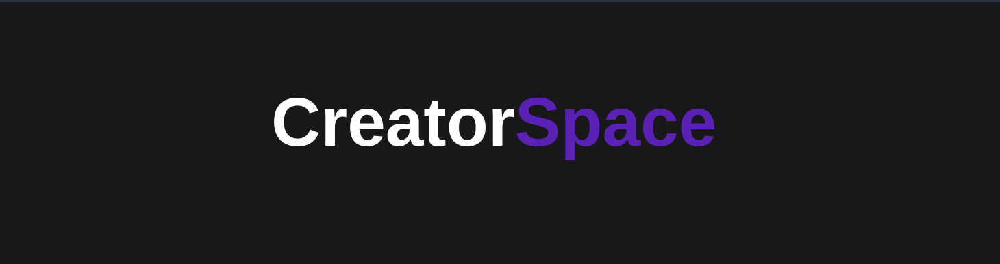

</a>

## 📌 Introduction 
CreatorSpace is a web3 platform that allows musicians to promote their work without the assistance of outside labels. We do this by giving artists the ability to design and release their own nft collections and by establishing a decentralised social media platform that enables them to communicate with their followers more directly.

Musicians and other creators don't have to immediately give platforms ownership of their works thanks to NFTs. When they mint an NFT, they have the option of giving up ownership of a song or album, but they can also choose to keep it if they add it to the NFT. Therefore, when content is sold, musicians can receive more equitable and direct payment. If an NFT owner chooses to sell the NFT again, the original author may be compensated automatically.

The decentralised social media platform is made using the lens protocol. Ownership of data, improved connectivity, access to more information, a permissionless network whose service cannot be interrupted, and the absence of a single entity controlling the information are some advantages of the Lens Protocol.

## 🏁 Tech Stack Used
- [NextJs](https://nextjs.org/)
- [Moralis](https://moralis.io/)

### Demo

</a>

